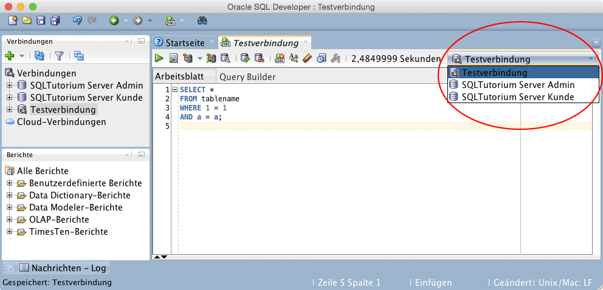

Zweitaccount
============

Für Teil 2 des Praktikums wird ein zweiter Benutzer als "Kunde" benötigt.

Um den zweiten Account anzulegen, muss eine Verbindung, wie im Abschnitt \":ref:`Verbindung-anlegen`\", erstellt werden. Dazu muss ein Account gefunden werden, der noch nicht benutzt wird. Das kann geprüft werden, in dem einfach das Standard-Passwort (dbsysXX) eingegeben wird. Wenn das Passwort akzeptiert wird, ist der Account noch frei.

Nun kann einfach zwischen den Verbindungen hin und her gewechselt werden:

  SQL Developer - Verbindung wechseln

Somit ist schnelles Umschalten zur/von Kunden-Ansicht möglich.