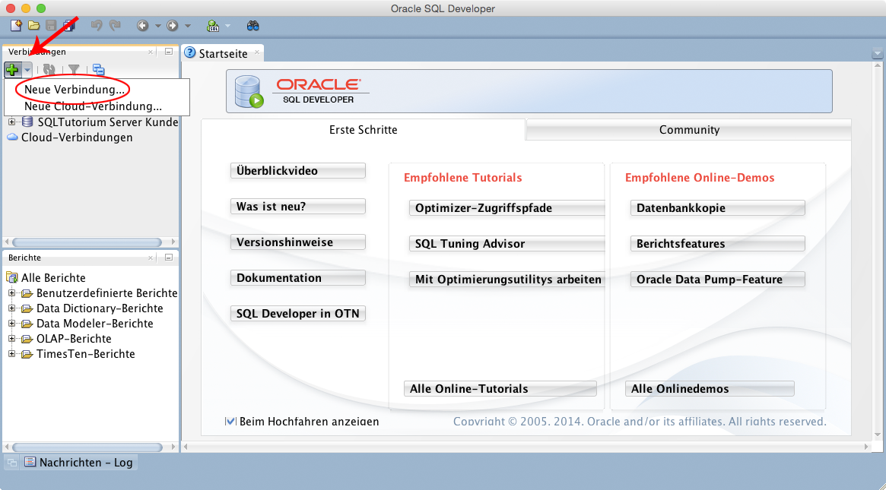
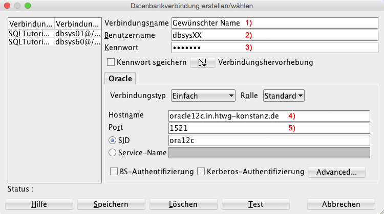
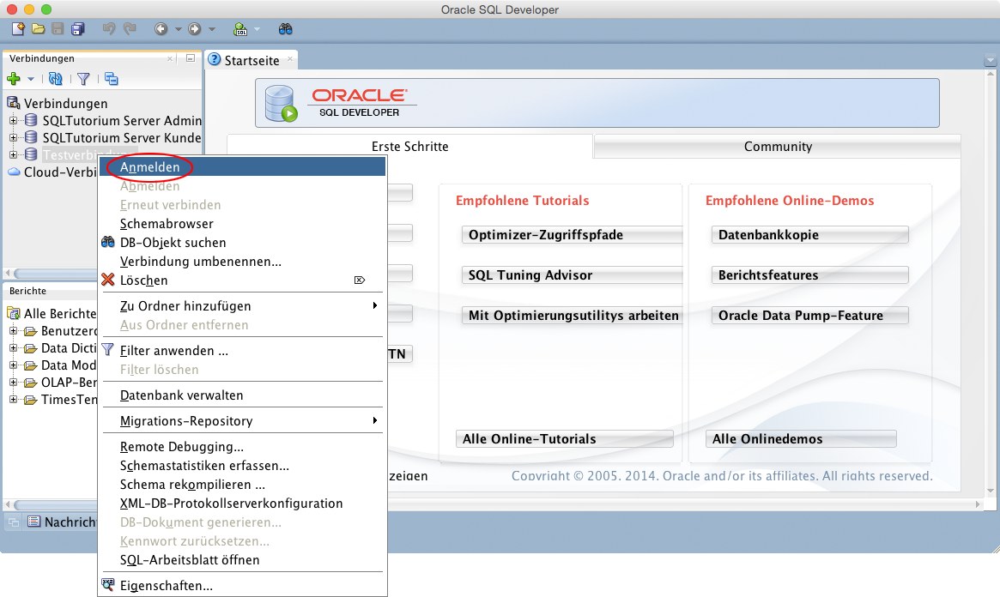

SQL Developer
=============

Mit dem SQL Developer werden die Tabellen und Daten auf dem SQL-Server der HTWG angelegt.
Im Folgenden ein kleines Tutorial wie man sich mit dem SQL Developer auf dem Server anmeldet.

.. figure:: _static/screenshots/SQL_Developer.png

  SQL Developer Startbildschirm

Verbindung anlegen
^^^^^^^^^^^^^^^^^^

.. warning::

  Damit man Zugriff auf den Datenbanken-Server hat, muss zu erst eine Verbindung zum VPN der HTWG hergestellt werden!

Um eine Verbindung mit dem Server herzustellen, muss zunächst eine neue Verbindung angelegt werden. Dies geschieht indem man unter "Verbindungen" auf "neue Verbindung..." (oder das grüne Plus-Zeichen) klickt:

  SQL Developer - Neue Verbindung

Dadurch öffnet sich ein Dialogfenster, in dem man die Verbindungsdaten eingeben muss.
Dort muss folgendes eingetragen werden:

  SQL Developer - Verbindungsdaten

::

  1) Verbindungsname: Der gewünschte Verbindungsname
  2) Benutzername:    dbsys + gewählte-Nr. (z.B. dbsys10) -> siehe TN-Liste
  3) Kennwort:        wie Benutzername
  4) Hostname:        oracle12c.in.htwg-konstanz.de
  5) SID (DB-Name):   ora12c

Durch Klick auf "Test" können die Einstellungen getestet werden. Wenn dabei keine Fehlermeldung erscheint, sind die Einstellungen korrekt.
Durch Klick auf "Speichern" wird die Verbindung gespeichert. Um das Fenster zu schließen, muss auf "Abbrechen" geklickt werden.

Verbindung herstellen
^^^^^^^^^^^^^^^^^^^^^

Um sich nun mit dem Server zu verbinden, muss auf die gerade erstellte Verbindung ein Rechtsklick gemacht und "Anmelden" ausgewählt werden:

  SQL Developer - Anmelden

Daraufhin wird die Verbindung zum Server hergestellt. Außerdem wird automatisch ein Skript mit dem Verbindungsnamen als Name angelegt. Hier können die SQL-Befehle reingeschrieben und ausgeführt werden (näheres dazu in :ref:`sql_befehle_ausfuehren`).

Passwort ändern
^^^^^^^^^^^^^^^

Nachdem die Verbindung erfolgreich hergestellt wurde sollte das Passwort des jeweiligen DBSys-Users geändert werden.

Dazu einfach in folgendes SQL-Statement eingeben (und die entsprechenden Daten anpassen):

.. code-block:: sql

   ALTER USER dbsysXX
   IDENTIFIED BY "altesPasswort(dbsysXX)"
   REPLACE "neuesPasswort"

Anschließend müssen die Änderungen auch in den Verbindungseinstellungen angepasst und sich erneut angemeldet werden.
